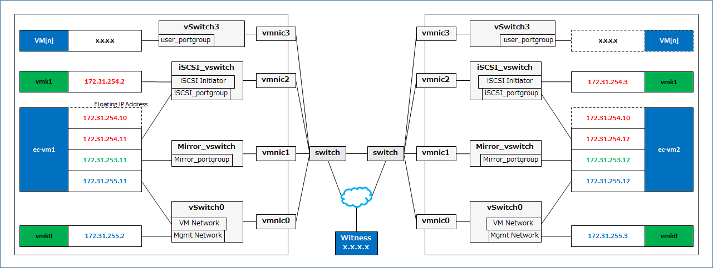

# VMware Host Clustering

Configure an HA Cluster of Hypervisor to protect VMs running on VMware.

## Architecture

- ECX of data mirroring configuration provides virtual shared disk for ESXi boxes by iSCSI Target clustering.
- ECX protects VMs on ESXi, means start / stop / monitor and realizing failover of VMs across ESXi boxes.

	

## Network

- Separating network for VM / management of VM and cluster / mirroring / iSCSI.

	

## Setting up ESXi - Base

Install vSphere ESXi then set up IP address of *Management Network* as following.

- Login to ESXi console > [Configure Management Network] > [IPv4 Configuration] >

  |			| Primary ESXi	| Secondary ESXi	|
  |:---			|:---		|:---			|
  | IPv4 Address	| 172.31.255.2	| 172.31.255.3		|
  | Subnet Mask		| 255.255.255.0 | 255.255.255.0		|
  | Default gateway	| 0.0.0.0	| 0.0.0.0		|

Install the licenses

- Obtain the license keys for both ESXi
- Open vSphere Host Client for ESXi#1 (http://172.31.255.2/) and ESXi#2 (http://172.31.255.3/).
  - [Manage] in [Navigator] pane > [Licensing] tab > [Actions] > [Assign license]
  - enter the license key > [Check license] > [Assign license]

## Setting up ESXi - Datastore

Add a new datastore and give it a common name across the ESXi boxes (*datastore1*).

- On vSphere Host Client for both ESXi,
  - [Storage] in [Navigator] pane > [Datastores] tab > [New datastore]
    - Select [Create new VMFS datastore] > [Next] > Input [datastore1] as [name] > Select the storage device for VMs.

## Setting up ESXi - Network

Start ssh service and configure it to start on boot.

- On vSphere Host Client for both ESXi,
  - [Manage] in [Navigator] pane > [Services] tab
    - [TSM-SSH] > [Actions] > [Start]
    - [TSM-SSH] > [Actions] > [Policy] > [Start and stop with host]

Configure NTP servers

- On vSphere Host Client for both ESXi,
  - [Manage] in [Navigator] pane > [System] tab
    - [Time and date] > [Edit settings]
      - Select [Use Network Time Protocol (enable NTP client)] > Select [Start and stop with host] as [NTP service startup policy] > input IP address of NTP server for the configuring environment as [NTP servers]

Configure vSwitch, Port groups, VMkernel NIC (for iSCSI Initiator) as described in the Network picture in above.

- Open putty/teraterm and connect to ESXi#1 (172.31.255.2) and ESXi#2 (172.31.255.3) then issue the below commands for both ESXi to do the followings.
  - Configure vSwitch, Physical NICs, Port groups.
  - Disable TSO (TCP Segmentation Offload), LRO (Large Receive Offload) and ATS (Atomic Test and Set) for the case of low iSCSI performance.
  - Configure ESXi to suppress the warning for disabling SSH on vSphere Host Client.

	    #!/bin/sh -ue

	    # Make vSwitch
	    esxcfg-vswitch --add Mirror_vswitch
	    esxcfg-vswitch --add iSCSI_vswitch
	    esxcfg-vswitch --add user_vswitch

	    # Configure vSwitch to have vmnic
	    esxcfg-vswitch --link=vmnic1 Mirror_vswitch
	    esxcfg-vswitch --link=vmnic2 iSCSI_vswitch
	    esxcfg-vswitch --link=vmnic3 user_vswitch

	    # Configure vSwitch to have port group
	    esxcfg-vswitch --add-pg=Mirror_portgroup Mirror_vswitch
	    esxcfg-vswitch --add-pg=iSCSI_portgroup iSCSI_vswitch
	    esxcfg-vswitch --add-pg=iSCSI_Initiator iSCSI_vswitch
	    esxcfg-vswitch --add-pg=user_portgroup user_vswitch

	    # Disabling TSO LRO ATS
	    esxcli system settings advanced set --option=/Net/UseHwTSO --int-value=0
	    esxcli system settings advanced set --option=/Net/UseHwTSO6 --int-value=0
	    esxcli system settings advanced set --option=/Net/TcpipDefLROEnabled --int-value=0
	    esxcli system settings advanced set --option=/VMFS3/UseATSForHBOnVMFS5 --int-value=0

	    # Suppress shell warning
	    esxcli system settings advanced set --option=/UserVars/SuppressShellWarning --int-value=1

- Configure VMkernel NIC for iSCSI Initiator and enable iSCSI Software Adapter
  - for ESXi#1

	    esxcfg-vmknic --add --ip 172.31.254.2 --netmask 255.255.255.0 iSCSI_Initiator
	    esxcli iscsi software set --enabled=true
	    /etc/init.d/hostd restart

  - for ESXi#2

	    esxcfg-vmknic --add --ip 172.31.254.3 --netmask 255.255.255.0 iSCSI_Initiator
	    esxcli iscsi software set --enabled=true
	    /etc/init.d/hostd restart

Continue to [Setting up iSCSI Target Cluster on VMware](iSCSI-cluster.md)
